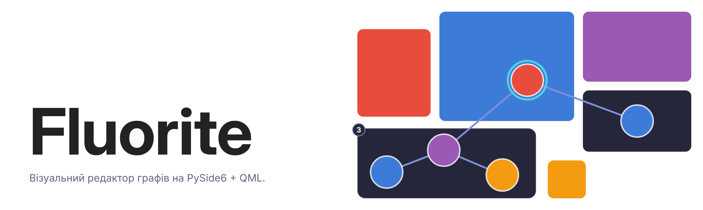

<picture>
  <source media="(prefers-color-scheme: dark)" srcset="assets/banner-light.png">
  
</picture>

# Fluorite

Візуальний редактор графів на **Python (PySide6 + QML / Qt Quick)** поверх моделі даних [FluoriteGraph](https://github.com/BogdanVR666/FluoriteGraph).
Створюйте вершини та ребра мишкою, групуйте вершини в класи з власним дизайном, зберігайте граф у JSON.

## Функціонал

- **Редагування графа мишкою** — ЛКМ по полю створює вершину (а якщо є виділення і не натиснуто Shift — знімає його), ПКМ по вершині чи ребру відкриває меню, ПКМ-перетяг між вершинами створює ребро, вершини перетягуються мишею.
- **Класи вершин** — можна створювати власні класи з іменем, формою та кольором. Нові вершини отримують дизайн свого класу, а зміна дизайну класу одразу застосовується до всіх його вершин (окрім тих, де стиль перекрито вручну). Панель класів уміє з'єднати всі вершини класу між собою (побудувати кліку). З'єднати виділені вершини з усіма вершинами іншого класу можна пунктом «З'єднати з класом…» у меню вершини.
- **Класи ребер** — так само, як вершини: власні класи з кольором, товщиною, стилем лінії (суцільна/пунктир/крапки) та **напрямленістю**. Ребра різних класів вільно співіснують на одній парі вершин (одне ребро класу на пару). Напрям стрілки задає ПКМ-перетяг (від якої вершини потягнули — та й джерело), а перевернути можна в контекстному меню ребра. Нові ребра отримують обраний клас.
- **Виділення вершин** — ЛКМ виділяє одну, **Shift+ЛКМ** додає/знімає, ЛКМ-перетяг по порожньому полю тягне **рамку виділення** (з Shift — доповнює наявне). Виділена група тягнеться як ціле, а контекстне меню й `Delete` діють одразу на всі виділені: форма, колір, прозорість, клас, з'єднання між собою чи з іншим класом, видалення. Текст і опис лишаються персональними — їх правлять лише в однієї вершини. `Escape` знімає виділення.
- **Контекстне меню вершини** — зміна форми, кольору, класу, видалення.
- **Контекстне меню ребра** (ПКМ по лінії) — зміна стилю лінії, товщини, кольору, класу, розворот напряму (для спрямованих), видалення ребра.
- **Збереження / завантаження** — граф серіалізується у JSON (вершини, ребра, всі класи обох родин разом з дизайном). Формат (version 7) ділиться на граф і вигляд, описаний у `storage.py`; старі файли (version 1–6) читаються. Приклади: `архітектура.json`, `дефолт_нейронка.json`.
- **Статистика** — кількість вершин, ребер і компонент зв'язності в статус-барі. Метавершина групи рахується як окрема вершина, а без власних ребер — і як окрема компонента.
- **Теми VS Code** — тема інтерфейсу (`qml/Theme.qml`) використовує стандартні ключі кольорів із JSON-тем VS Code, тож решту коду для іншої теми міняти не треба. Підключається тема через `Theme.load(json)`, але інтерфейсу для цього ще немає.

## Структура проєкту

| Файл | Призначення |
|---|---|
| `main.py` | Точка входу: створює `QGuiApplication`, бекенд і QML-рушій |
| `FluoriteGraph.py` | Модель даних: типи вершин і ребер, вершини, ребра, гіперребра. Тимчасова копія бібліотеки [FluoriteGraph](https://github.com/BogdanVR666/FluoriteGraph), поки вона не стане пакетом |
| `view.py` | Модель вигляду: позиції, стилі, дизайн і порядок типів, схованість, стандартні типи, групи на екрані |
| `document.py` | `Document` — граф + вигляд + індекси (тип вершини, ребра вершини, групи), усі зміни графа, без Qt |
| `history.py` | Історія змін для Ctrl+Z / Ctrl+Shift+Z |
| `graphs.py` | Прослойка документ↔QML: `GraphBackend` (слоти й сигнали), `NodesModel`, `EdgeLayer` |
| `storage.py` | Серіалізація документа в рядок JSON і назад — єдине місце, що знає формат файлу. Сам файл читає й записує `GraphBackend` |
| `qml/` | Інтерфейс: головне вікно, вершина, панель класів, контекстні меню вершини та ребра, тема |

## Вимоги

- Python **3.13+**
- [uv](https://docs.astral.sh/uv/) (менеджер пакетів — сам створить віртуальне середовище і поставить залежності)

Залежності: `pyside6` (див. `pyproject.toml`).

## Запуск

```bash
git clone https://github.com/BogdanVR666/Fluorite.git
cd Fluorite
uv run main.py
```

Перший запуск автоматично встановить залежності. Без uv:

```bash
python -m venv .venv && source .venv/bin/activate
pip install pyside6
python main.py
```

## Плани

- Компіляція в один виконуваний файл через Nuitka
- UI для завантаження тем VS Code
- Умови зв'язків між класами
- Детальний опис архітектури, щоб усі (особливо нейронки) знали, як цим користуватись
